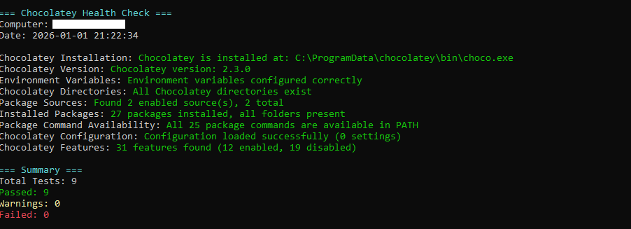
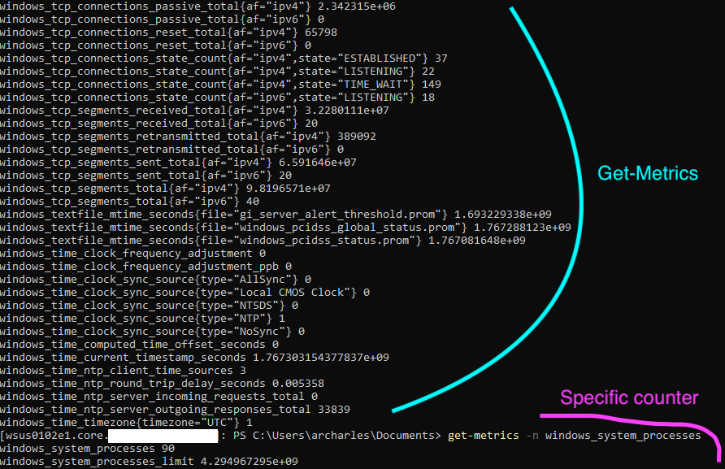
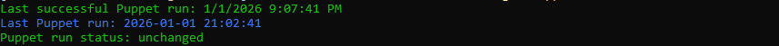
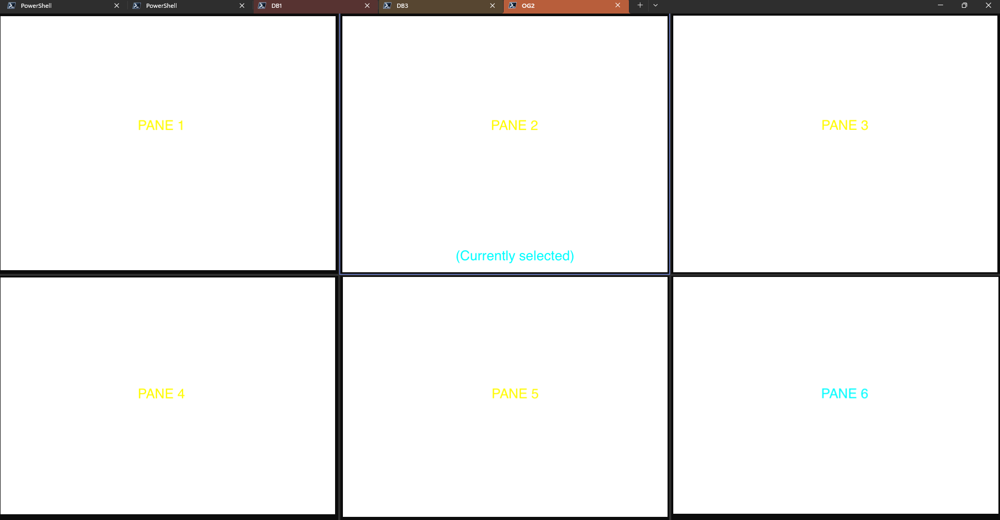
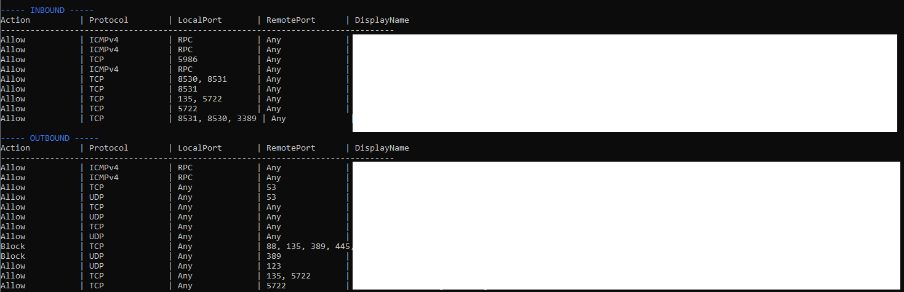

<div align="center">

# PSSyAd

**PSSyAd** stand for "**P**ower**S**hell **Sy**stem **Ad**ministration".
</div>

It's a collection of scripts used everyday or at least often to make them as functions.


<p align="center">  </p>

<div align="center">

[](https://github.com/qoomon/starline)


</div>
<br>
<br>

## 👀 What it look like

### **Chocolatey**

Functions to load the choco GUI or validate few stuff about chocolatey

<p align="center">  </p>

### **Prometheus**

Functions to retreive jobs, metrics, ...
<p align="center">  </p>

### **Puppet**

Functions to run Puppet, get the status or classes applied,...
<p align="center">  </p>

### **Qualys**

Functions to manage Qualys

### **Split-Pane**
<p align="center">  </p>

### **Copy-RemoteFile**
Simple function to copy from/to remote computer

### **Get-FW**
A simple or visual way to see Firewall rules.
<p align="center">  </p>

See more in the [examples](./examples/)

## 💪 Advantages

<table align="center">
<tr>
<td align="center" style="color: #8d2640ff">🔗<br><b>No dependency</b></td>
<td align="center" style="color: #6a741cff">🛼<br><b>Simple</b></td>
<td align="center" style="color: #3d9393ff">🌌<br><b>Reusable</b></td>
<td align="center" style="color: #207bcd">🌎<br><b>Local or Remote</b></td>
<td align="center" style="color: #20cda8ff">🫧<br><b>Lightweight</b></td>
</tr>
</table>

## 📄 Prerequisites

- Require PowerShell 7

## 📦 Installation

To install the module from the [PowerShell Gallery](https://www.powershellgallery.com/packages/PSSyAd/), you can use the following command:

```powershell
Install-PSResource -Name PSSyAd
Import-Module -Name PSSyAd
```

<br>
💡 Feel free to create aliases, check the [aliases.ps1](./src/functions/aliases.ps1) file.
<br>


## 🔩 Example of Usage

⚠️ Take care that some public functions are using and depend on private functions. Feel free to look the *Functions dependencies* part below.


To find more examples of how to use the module, please refer to the [examples](examples) folder.

Alternatively, you can use the Get-Command -Module 'PSSyAd' to find more commands that are available in the module.
To find examples of each of the commands you can use Get-Help -Examples 'CommandName'.


## 📰 How it started

Days after days we (me and my colleagues) needed new functions that we built from source or by ourself to make our daily tasks more convenient, respond quicker or simply reduce the daily toil.

Because we share our work, an internal module as been created for this purpose and the speach was since year to share that to the community, never done until today !
Here you will find some of our functions, we hope it can help you too.

## 🔗 Functions dependencies

See [Function Dependencies](DEPENDENCIES.md) to understand link between each functions.

## 🔧 Contributing

Coder or not, you can contribute to the project! We welcome all contributions.

### 🧑‍💻 For Users

If you don't code, you still sit on valuable information that can make this project even better. If you experience that the
product does unexpected things, throw errors or is missing functionality, you can help by submitting bugs and feature requests.
Please see the issues tab on this project and submit a new issue that matches your needs.

### 🧑‍🔧 For Developers

If you do code, we'd love to have your contributions. Please read the [Contribution guidelines](CONTRIBUTING.md) for more information.
You can either help by picking up an existing issue or submit a new one if you have an idea for a new feature or improvement.

## 📣 Ref

Thanks to [Marius](https://github.com/MariusStorhaug) for his job on [PsModule Framework](https://psmodule.io/ ) used to built the skeleton of PSSyAd.

Thanks to my colleagues who challenged me, helped me publish it and using it daily.
